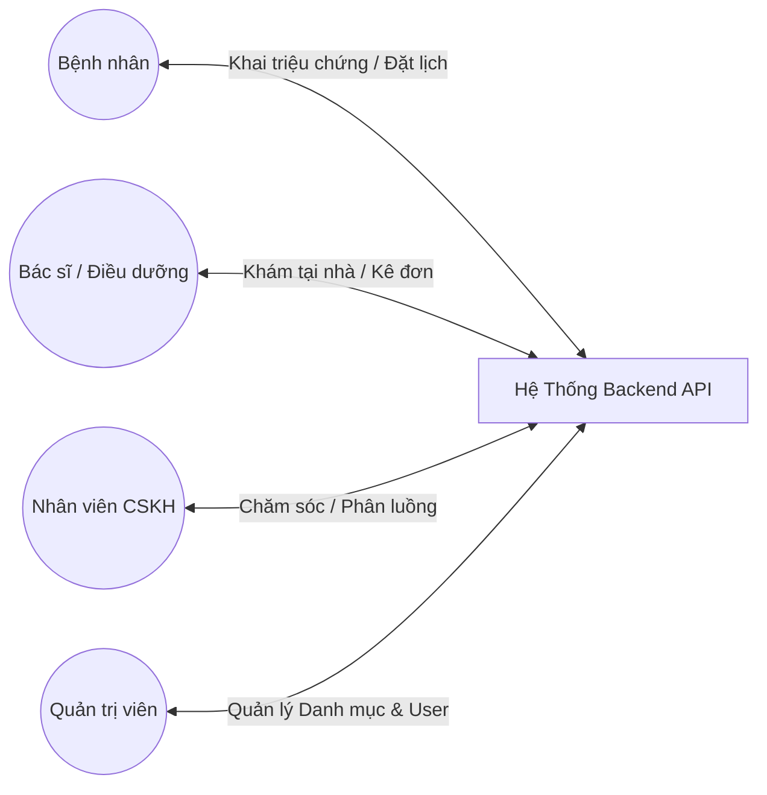
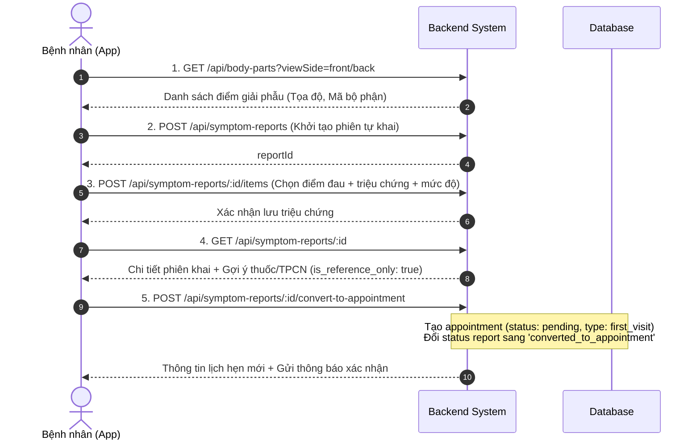
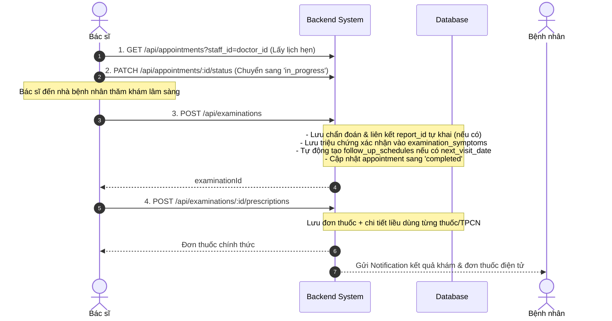
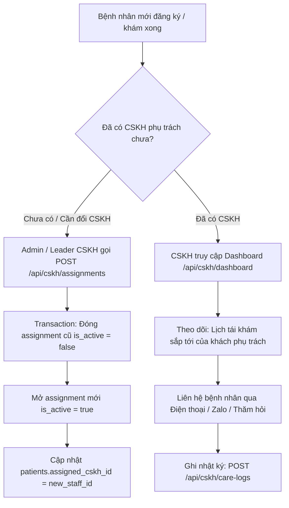
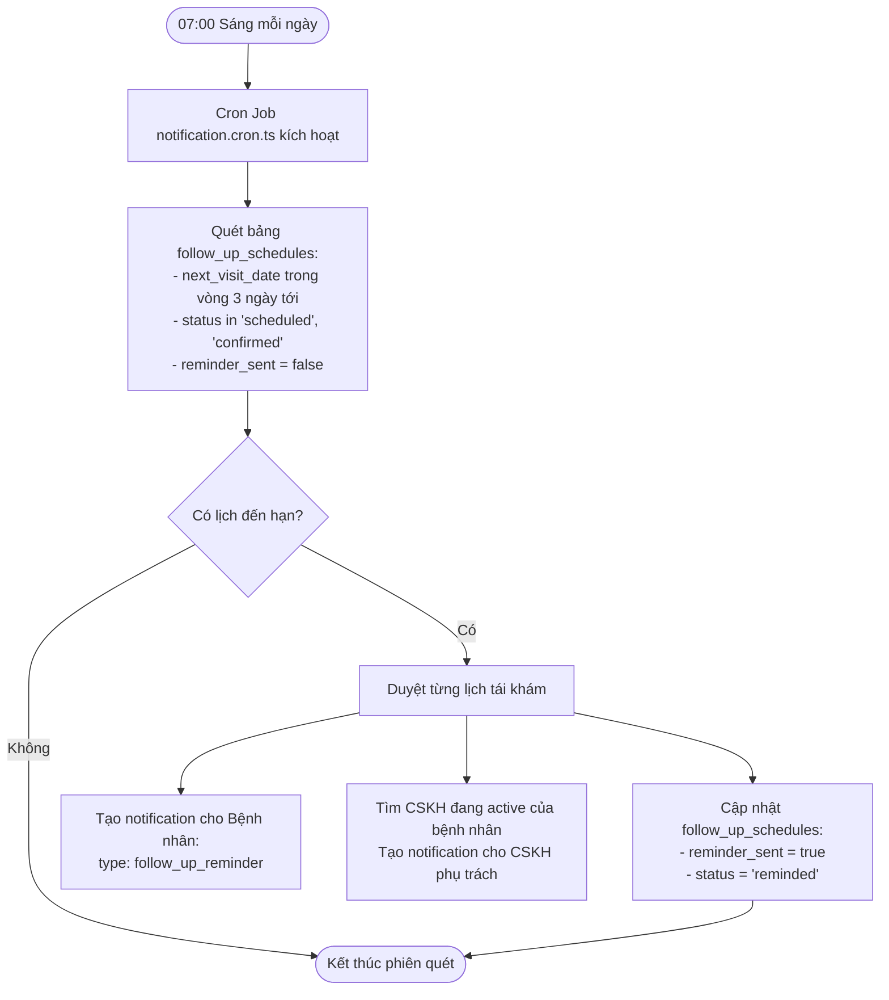
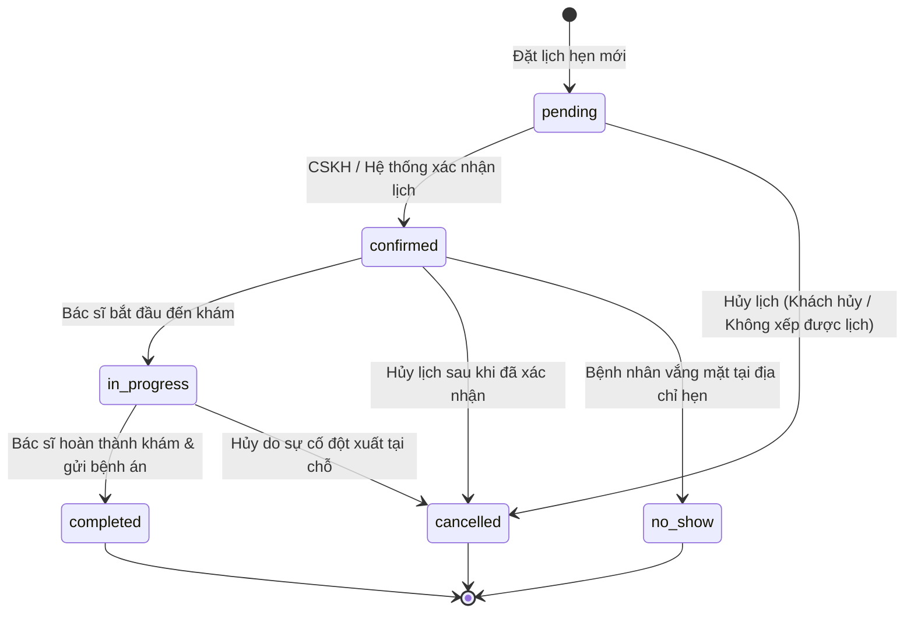
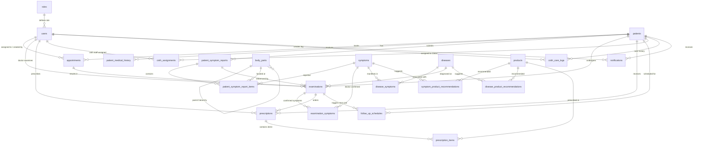

# 📘 TÀI LIỆU ĐẶC TẢ NGHIỆP VỤ HỆ THỐNG
# QUẢN LÝ KHÁM CHỮA BỆNH TẠI NHÀ & CHĂM SÓC BỆNH NHÂN (HOME HEALTHCARE & PATIENT CRM)

---

## 📑 MỤC LỤC
1. [TỔNG QUAN HỆ THỐNG](#1-tổng-quan-hệ-thống)
   - 1.1. Bối cảnh & Mục tiêu
   - 1.2. Đối tượng thụ hưởng & Mô hình vận hành
2. [MA TRẬN PHÂN QUYỀN & VAI TRÒ (RBAC)](#2-ma-trận-phân-quyền--vai-trò-rbac)
   - 2.1. Định danh các nhóm Actor
   - 2.2. Ma trận phân quyền chức năng
3. [CÁC QUY TRÌNH NGHIỆP VỤ CHÍNH (BUSINESS PROCESSES)](#3-các-quy-trình-nghiệp-vụ-chính-business-processes)
   - 3.1. Quy trình Khai báo triệu chứng Body Map & Đặt lịch khám
   - 3.2. Quy trình Khám chữa bệnh tại nhà & Kê đơn thuốc (Bác sĩ)
   - 3.3. Quy trình Phân công & Chăm sóc khách hàng (CSKH)
   - 3.4. Chu trình Tự động nhắc lịch Tái khám (Cron Job)
4. [CÁC QUY TẮC NGHIỆP VỤ CỐT LÕI (CORE BUSINESS RULES)](#4-các-quy-tắc-nghiệp-vụ-cốt-lõi-core-business-rules)
   - Rule 1: Nguyên tắc Phân công CSKH độc quyền
   - Rule 2: Phân lập Dữ liệu tự khai và Dữ liệu lâm sàng
   - Rule 3: Cảnh báo Pháp lý Y tế đối với Sản phẩm gợi ý
   - Rule 4: Tự động hóa Vòng đời Tái khám
   - Rule 5: Máy trạng thái Lịch hẹn (Appointment State Machine)
   - Rule 6: Cơ chế Quét tự động & Cảnh báo thông báo
   - Rule 7: Bảo mật Dữ liệu Sức khỏe & Quyền riêng tư (PII)
5. [MÔ HÌNH THỰC THỂ DỮ LIỆU & QUAN HỆ (DOMAIN DATA MODEL)](#5-mô-hình-thực-thể-dữ-liệu--quan-hệ-domain-data-model)
   - 5.1. Sơ đồ Thực thể Quan hệ (ERD)
   - 5.2. Giải nghĩa các thực thể dữ liệu nghiệp vụ
6. [DANH MỤC TRẠNG THÁI & MÃ HÓA NGHIỆP VỤ (ENUMS & CODES)](#6-danh-mục-trạng-thái--mã-hóa-nghiệp-vụ-enums--codes)

---

## 1. TỔNG QUAN HỆ THỐNG

### 1.1. Bối cảnh & Mục tiêu
Hệ thống **Home Healthcare & Patient CRM** là giải pháp phần mềm y tế phục vụ mô hình **khám chữa bệnh tại nhà kết hợp chăm sóc khách hàng chủ động**. Mục tiêu cốt lõi:
- **Tối ưu hóa hành trình bệnh nhân**: Cho phép bệnh nhân mô tả trực quan triệu chứng trên mô hình người 2D/3D (Body Map), nhận thông tin tư vấn tham khảo sơ bộ và đặt lịch bác sĩ đến tận nhà thăm khám.
- **Chuẩn hóa hồ sơ bệnh án điện tử (EMR)**: Bác sĩ ghi nhận kết quả khám, chẩn đoán theo mã ICD, kê đơn thuốc điện tử và lên lịch tái khám chính xác.
- **Chăm sóc khách hàng toàn diện (CRM y tế)**: Phân luồng mỗi bệnh nhân cho một nhân viên CSKH quản lý, theo dõi lịch sử tương tác, nhật ký sức khỏe và tự động hóa nhắc nhở tái khám.

### 1.2. Đối tượng thụ hưởng & Mô hình vận hành

---

## 2. MA TRẬN PHÂN QUYỀN & VAI TRÒ (RBAC)

### 2.1. Định danh các nhóm Actor
| Mã Role | Tên hiển thị | Kênh truy cập | Trách nhiệm chính |
| :--- | :--- | :--- | :--- |
| `patient` | Bệnh nhân / Khách hàng | Mobile App | Đăng ký qua SĐT/OTP, tự khai triệu chứng qua Body Map, đặt lịch khám, xem bệnh án & đơn thuốc của chính mình |
| `doctor` | Bác sĩ khám tại nhà | Mobile / Web App | Xem lịch được phân công, đến nhà khám bệnh, chẩn đoán, xác nhận triệu chứng, kê đơn, hẹn tái khám |
| `nurse` | Điều dưỡng tại nhà | Mobile / Web App | Xem lịch khám, hỗ trợ lấy mẫu/thực hiện y lệnh chăm sóc tại nhà |
| `cskh` | Nhân viên CSKH | Web CRM / App | Phân công phụ trách khách, gọi điện/nhắn tin chăm sóc, theo dõi dashboard tái khám, hỗ trợ đặt lịch |
| `admin` | Quản trị viên hệ thống | Web Admin | Quản lý danh mục y tế (bệnh, triệu chứng, thuốc, vị trí giải phẫu), tài khoản nhân viên, cấu hình hệ thống |

### 2.2. Ma trận phân quyền chức năng
| Module / Nghiệp vụ | Patient | Doctor | Nurse | CSKH | Admin |
| :--- | :---: | :---: | :---: | :---: | :---: |
| **Đăng ký OTP & Đăng nhập khách** | ✅ | ❌ | ❌ | ❌ | ❌ |
| **Đăng nhập nội bộ (Email/Pass)** | ❌ | ✅ | ✅ | ✅ | ✅ |
| **Xem Body Map & Gợi ý sơ bộ** | ✅ | ✅ | ✅ | ✅ | ✅ |
| **Tạo phiên tự khai triệu chứng** | ✅ | ❌ | ❌ | ✅ (hộ) | ❌ |
| **Đặt lịch hẹn khám tại nhà** | ✅ | ❌ | ❌ | ✅ (hộ) | ✅ |
| **Xem danh sách lịch hẹn** | ✅ (chính mình)| ✅ (được phân) | ✅ (được phân) | ✅ (toàn bộ) | ✅ (toàn bộ) |
| **Cập nhật trạng thái lịch hẹn** | ❌ | ✅ | ✅ | ✅ | ✅ |
| **Phân công Bác sĩ/Điều dưỡng** | ❌ | ❌ | ❌ | ✅ | ✅ |
| **Ghi nhận kết quả khám & chẩn đoán**| ❌ | ✅ | ❌ | ❌ | ✅ |
| **Kê đơn thuốc điện tử** | ❌ | ✅ | ❌ | ❌ | ✅ |
| **Xem hồ sơ & Lịch sử khám** | ✅ (chính mình)| ✅ | ✅ | ✅ | ✅ |
| **Quản lý danh mục y tế & Thuốc** | ❌ | Xem | Xem | Xem | ✅ (CRUD) |
| **Phân công CSKH phụ trách** | ❌ | ❌ | ❌ | ✅ | ✅ |
| **Ghi nhật ký CSKH (Care Logs)** | ❌ | ❌ | ❌ | ✅ | ✅ |
| **Dashboard CSKH** | ❌ | ❌ | ❌ | ✅ | ✅ |
| **Quản lý tài khoản nhân viên** | ❌ | ❌ | ❌ | ❌ | ✅ |

---

## 3. CÁC QUY TRÌNH NGHIỆP VỤ CHÍNH (BUSINESS PROCESSES)

### 3.1. Quy trình Khai báo triệu chứng Body Map & Đặt lịch khám
Quy trình giúp bệnh nhân định vị vị trí đau trên cơ thể và chuyển đổi thành yêu cầu khám:

### 3.2. Quy trình Khám chữa bệnh tại nhà & Kê đơn thuốc (Bác sĩ)
Bác sĩ thực hiện quy trình nghiệp vụ chuyên môn độc lập:

### 3.3. Quy trình Phân công & Chăm sóc khách hàng (CSKH)
Quy tắc một cửa chăm sóc bệnh nhân:

### 3.4. Chu trình Tự động nhắc lịch Tái khám (Cron Job)
Cơ chế tự động hóa vận hành mỗi 07:00 sáng hằng ngày:

---

## 4. CÁC QUY TẮC NGHIỆP VỤ CỐT LÕI (CORE BUSINESS RULES)

### 📌 Rule 1: Nguyên tắc Phân công CSKH độc quyền (Single Active CSKH)
- **Mục tiêu**: Tránh tình trạng nhiều nhân viên CSKH cùng lúc liên hệ làm phiền khách hàng, hoặc ngược lại bỏ quên khách hàng.
- **Ràng buộc**: Tại mọi thời điểm, một bệnh nhân **chỉ có duy nhất 1 bản ghi `cskh_assignments` có `is_active = true`**.
- **Cơ chế kỹ thuật**: 
  - Thực thi thông qua **Prisma Database Transaction** (`tx.$transaction`).
  - Khi tạo phân công mới: Tìm mọi phân công đang active của bệnh nhân đó ➔ cập nhật `is_active = false`, `unassigned_at = NOW()` ➔ tạo bản ghi mới với `is_active = true` ➔ cập nhật trường `patients.assigned_cskh_id`.

### 📌 Rule 2: Phân lập Dữ liệu tự khai và Dữ liệu lâm sàng
- **Mục tiêu**: Bảo đảm tính chính xác và giá trị pháp lý y khoa của bệnh án điện tử.
- **Ràng buộc**: 
  - Dữ liệu bệnh nhân tự bấm chọn trên Body Map (`patient_symptom_reports` và `patient_symptom_report_items`) là **dữ liệu chủ quan mang tính tham khảo**, **KHÔNG ĐƯỢC TỰ ĐỘNG SAO CHÉP** vào bảng triệu chứng khám bệnh chính thức (`examination_symptoms`).
  - Khi bác sĩ khám bệnh tại nhà, bác sĩ sẽ xem lại thông tin tự khai qua liên kết `examinations.report_id`. Sau khi khám thực tế, bác sĩ tự tay nhập hoặc tích chọn các triệu chứng y khoa được khẳng định vào `examination_symptoms`.

### 📌 Rule 3: Cảnh báo Pháp lý Y tế đối với Sản phẩm gợi ý (Medical Disclaimer)
- **Mục tiêu**: Tuân thủ luật khám chữa bệnh và bảo vệ sức khỏe người dùng, tránh việc người dùng tự ý mua thuốc điều trị khi chưa có chỉ định của bác sĩ.
- **Ràng buộc**:
  - Mọi API trả về danh sách gợi ý thuốc/TPCN dựa trên triệu chứng hoặc bệnh lý (`/recommendations`, `/symptom-reports/:id`) **bắt buộc phải trả về thuộc tính `is_reference_only: true`**.
  - Bắt buộc kèm theo thông điệp cảnh báo pháp lý (`disclaimer`): *"Các sản phẩm thuốc/TPCN dưới đây chỉ mang tính chất tham khảo sơ bộ dựa trên triệu chứng tự khai, KHÔNG thay thế chỉ định và đơn thuốc chính thức từ bác sĩ chuyên môn."*

### 📌 Rule 4: Tự động hóa Vòng đời Tái khám (Auto Follow-up Scheduling)
- **Mục tiêu**: Khép kín chu trình điều trị, không để sót bệnh nhân cần theo dõi sau đợt khám cấp tính hoặc mãn tính.
- **Ràng buộc**:
  - Khi bác sĩ tạo kết quả khám bệnh (`POST /api/examinations`) mà có chỉ định ngày tái khám (`next_visit_date` khác null) ➔ Hệ thống trong cùng transaction đó **phải tự động tạo ngay một bản ghi trong `follow_up_schedules`** với trạng thái `scheduled`, `reminder_sent = false`.

### 📌 Rule 5: Máy trạng thái Lịch hẹn (Appointment State Machine)
- **Mục tiêu**: Bảo đảm luồng nghiệp vụ khám diễn ra tuần tự, ngăn ngừa việc nhân viên hoặc hệ thống nhảy cóc trạng thái.
- **Sơ đồ chuyển trạng thái hợp lệ**:

- **Quy tắc chặn**:
  - Tuyệt đối không cho phép chuyển từ `pending` sang `completed` (bắt buộc phải qua bước khám).
  - Trạng thái `completed`, `cancelled`, `no_show` là trạng thái kết thúc (Terminal states), không thể đổi sang bất kỳ trạng thái nào khác.

### 📌 Rule 6: Cơ chế Quét tự động & Cảnh báo thông báo
- **Mục tiêu**: Tự động thông báo trước cho bệnh nhân chuẩn bị và nhắc CSKH liên hệ chăm sóc.
- **Ràng buộc**:
  - Định kỳ mỗi ngày vào 07:00 sáng, hệ thống tự động quét các lịch tái khám nằm trong khoảng `[hôm nay, hôm nay + X ngày]` (mặc định X = 3 ngày) mà chưa gửi nhắc (`reminder_sent = false`).
  - Gửi thông báo kép:
    1. Thông báo cho Bệnh nhân (`patient_id`).
    2. Thông báo cho CSKH đang phụ trách (`user_id` của CSKH active).
  - Cập nhật `reminder_sent = true`, chuyển trạng thái `status = 'reminded'`.

### 📌 Rule 7: Bảo mật Dữ liệu Sức khỏe & Quyền riêng tư (PII & Medical Privacy)
- **Mục tiêu**: Đảm bảo an toàn thông tin cá nhân và bảo mật dữ liệu y tế theo chuẩn quốc tế.
- **Ràng buộc**:
  - Bệnh nhân chỉ có quyền đọc và sửa thông tin của chính mình (`patientAccessGuard`). Không thể xem dữ liệu khám, đơn thuốc, lịch hẹn của bệnh nhân khác bằng cách đổi ID trên URL.
  - Mật khẩu của nhân viên nội bộ luôn được mã hóa một chiều bằng thuật toán `bcrypt` với `saltRounds = 10`.
  - Token JWT phân tách rõ: `accessToken` (thời hạn ngắn: 15 phút) và `refreshToken` (thời hạn dài: 7 ngày).

---

## 5. MÔ HÌNH THỰC THỂ DỮ LIỆU & QUAN HỆ (DOMAIN DATA MODEL)

### 5.1. Sơ đồ Thực thể Quan hệ (ERD Nghiệp Vụ)

### 5.2. Giải nghĩa các thực thể dữ liệu nghiệp vụ

| Tên bảng / Entity | Ý nghĩa nghiệp vụ |
| :--- | :--- |
| `roles` | Bảng danh mục vai trò hệ thống: `admin`, `doctor`, `nurse`, `cskh`. |
| `users` | Tài khoản nhân viên nội bộ của cơ sở y tế (Bác sĩ, Điều dưỡng, CSKH, Quản trị viên). |
| `patients` | Hồ sơ thông tin hành chính của bệnh nhân/khách hàng (Họ tên, ngày sinh, giới tính, địa chỉ, bảo hiểm, người liên hệ khẩn cấp). |
| `patient_medical_history` | Tiền sử bệnh lý, dị ứng thuốc, bệnh mạn tính của bệnh nhân. |
| `body_parts` | Tọa độ và danh mục các điểm giải phẫu trên mô hình cơ thể 2D/3D (Mặt trước/Mặt sau). |
| `patient_symptom_reports` | Phiên tự khai báo triệu chứng của bệnh nhân trên ứng dụng di động. |
| `patient_symptom_report_items`| Chi tiết từng điểm đau, triệu chứng và mức độ nghiêm trọng bệnh nhân tự khai. |
| `symptoms` | Danh mục chuẩn các triệu chứng y tế (Sốt, đau đầu, ho, đau bụng,...). |
| `diseases` | Danh mục bệnh lý chuẩn y khoa kèm mã phân loại quốc tế ICD-10. |
| `disease_symptoms` | Bảng liên kết ánh xạ bệnh lý với các triệu chứng đặc trưng. |
| `products` | Danh mục Thuốc kê đơn, Thuốc không kê đơn và Thực phẩm chức năng (TPCN). |
| `symptom_product_recommendations` | Cấu hình gợi ý sản phẩm tham khảo theo triệu chứng sơ bộ. |
| `disease_product_recommendations` | Cấu hình gợi ý sản phẩm tham khảo theo bệnh lý sơ bộ. |
| `appointments` | Lịch hẹn khám chữa bệnh tại nhà của bệnh nhân (Thời gian hẹn, địa chỉ khám, trạng thái). |
| `examinations` | Hồ sơ kết quả khám bệnh tại nhà do Bác sĩ lập (Chẩn đoán, ghi chú lâm sàng, ngày hẹn tái khám). |
| `examination_symptoms` | Các triệu chứng lâm sàng thực tế được Bác sĩ kiểm tra và xác nhận trong buổi khám. |
| `prescriptions` | Đơn thuốc điện tử chính thức được Bác sĩ ban hành sau buổi khám. |
| `prescription_items` | Chi tiết các loại thuốc trong đơn (Liều lượng, cách dùng, số lượng, số ngày uống). |
| `follow_up_schedules` | Kế hoạch lịch hẹn tái khám của bệnh nhân, theo dõi trạng thái gửi nhắc nhở. |
| `notifications` | Hộp thư thông báo trong ứng dụng cho cả bệnh nhân và nhân viên (Nhắc lịch, xác nhận lịch, chăm sóc). |
| `cskh_assignments` | Lịch sử và trạng thái phân công nhân viên CSKH phụ trách từng bệnh nhân. |
| `cskh_care_logs` | Sổ nhật ký ghi lại các lần tương tác chăm sóc khách hàng (Cuộc gọi, nhắn tin, Zalo, thăm hỏi). |

---

## 6. DANH MỤC TRẠNG THÁI & MÃ HÓA NGHIỆP VỤ (ENUMS & CODES)

### 6.1. Trạng thái Lịch hẹn (`appointment_status`)
- `pending`: Khách hàng vừa đặt lịch hoặc vừa tạo từ Body Map, đang đợi xác nhận.
- `confirmed`: Đã được CSKH/Hệ thống gọi điện xác nhận và sắp xếp nhân sự khám.
- `in_progress`: Bác sĩ/Điều dưỡng đang di chuyển đến nhà hoặc đang thực hiện khám tại chỗ.
- `completed`: Đã hoàn tất buổi khám, đã lập kết quả khám và kê đơn thuốc xong.
- `cancelled`: Lịch hẹn bị hủy do khách hàng yêu cầu hoặc không bố trí được nhân sự.
- `no_show`: Bác sĩ đến địa chỉ hẹn nhưng không gặp được bệnh nhân / bệnh nhân vắng mặt.

### 6.2. Loại hình Lịch hẹn (`appointment_type`)
- `first_visit`: Khám lần đầu tiên hoặc khám một đợt bệnh mới phát sinh.
- `follow_up`: Khám tái khám theo chỉ định của đợt khám trước đó.
- `emergency`: Yêu cầu khám ưu tiên khẩn cấp tại nhà.

### 6.3. Trạng thái Tái khám (`followup_status`)
- `scheduled`: Đã lên lịch hẹn tái khám trong tương lai.
- `reminded`: Hệ thống/CSKH đã gửi thông báo nhắc lịch cho bệnh nhân trước ngày khám.
- `confirmed`: Bệnh nhân đã xác nhận đồng ý ngày giờ tái khám.
- `completed`: Đã thực hiện khám tái khám xong (chuyển đổi thành lần khám mới).
- `missed`: Bệnh nhân bỏ lỡ lịch tái khám.
- `cancelled`: Bệnh nhân từ chối hoặc hủy lịch tái khám.

### 6.4. Loại Tương tác Chăm sóc Khách hàng (`care_interaction_type`)
- `call`: Gọi điện thoại trực tiếp thăm hỏi sức khỏe.
- `message`: Nhắn tin SMS.
- `zalo`: Nhắn tin hoặc gọi điện qua ứng dụng Zalo OA/Zalo cá nhân.
- `email`: Gửi email hướng dẫn chế độ sinh hoạt hoặc thông tin sức khỏe.
- `home_visit`: Thăm hỏi trực tiếp tại nhà bệnh nhân.
- `other`: Các kênh tương tác khác.

### 6.5. Loại Thông báo (`notification_type`)
- `follow_up_reminder`: Nhắc nhở lịch tái khám sắp đến hạn.
- `appointment_confirmation`: Thông báo lịch hẹn khám tại nhà đã được ghi nhận/xác nhận.
- `cskh_care`: Tin nhắn hỏi thăm sức khỏe sau điều trị từ nhân viên CSKH.
- `medicine_reminder`: Nhắc nhở uống thuốc đúng giờ theo đơn.
- `system`: Thông báo hệ thống, phân công công việc nội bộ.

### 6.6. Mức độ Nghiêm trọng của Triệu chứng (`severity_level`)
- `mild`: Nhẹ, chưa ảnh hưởng nhiều đến sinh hoạt.
- `moderate`: Vừa phải, bắt đầu gây khó chịu hoặc hạn chế vận động.
- `severe`: Nghiêm trọng, đau dữ dội hoặc có dấu hiệu cảnh báo nguy hiểm.

---
*Tài liệu nghiệp vụ được chuẩn hóa bởi Senior Developer - Hệ thống Home Healthcare & Patient CRM.*
